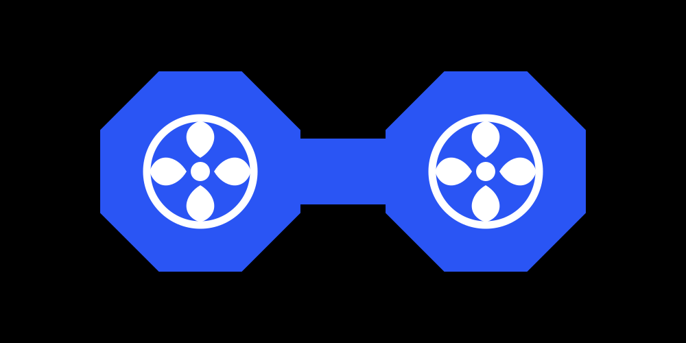

# air9s

<p align="center">
  
</p>

<p align="center">
  <a href="https://aymanzahran.github.io/air9s/">Website</a>
  ·
  <a href="https://github.com/AymanZahran/air9s/actions/workflows/ci.yml">CI</a>
  ·
  <a href="LICENSE">MIT</a>
</p>

air9s is a keyboard-first finder for local AI coding sessions. It indexes the session files already on your machine, then lets you search, preview, filter, resume, and — where it is safe — delete them.

The interface follows the k9s screen: a menu of hotkeys, a crumbs bar (`air9s › Sessions › all`), a framed table with a cursor row, a filter prompt, and a preview. Each agent has its own icon. `1` through `5` switch the table between sessions, providers, directories, branches, and models. `/` edits the filter and `:` opens a command line for those views and for filter tokens. Esc clears the filter from the list and from the filter line. `?` opens a scrollable manual. Tab moves into the preview so the excerpt can be scrolled; Tab or Esc returns to the list. The CTX column, the preview, and `air9s show` include context size and token counts when the agent recorded them.

Colors, the mouse, icons, read-only mode, the starting view, and plugins come from `~/.config/air9s/config.yaml` (or `$AIR9S_CONFIG_DIR`, or `$XDG_CONFIG_HOME/air9s`). `air9s info` prints the paths.

## Install

### Homebrew

```sh
brew tap AymanZahran/air9s
brew trust aymanzahran/air9s
brew install air9s
```

The formula is in [AymanZahran/homebrew-air9s](https://github.com/AymanZahran/homebrew-air9s). `brew install --HEAD air9s` builds the latest `main` once that repository can be cloned over HTTPS.

While those repositories are private, tap over SSH, trust the tap, and export a GitHub token so Homebrew can download the release archive. Install that tagged formula. `--HEAD` cannot clone the private source repository over HTTPS.

```sh
brew tap AymanZahran/air9s git@github.com:AymanZahran/homebrew-air9s.git
brew trust aymanzahran/air9s
export HOMEBREW_GITHUB_API_TOKEN="$(gh auth token)"
brew install air9s
```

### From source

Requires Go 1.25 or newer.

```sh
git clone https://github.com/AymanZahran/air9s.git
cd air9s
make install
```

`make install` puts the binary in `~/.local/bin`. Override that with `make install PREFIX=/usr/local`.

```sh
go install github.com/AymanZahran/air9s/cmd/air9s@latest
```

## Usage

```sh
air9s                 # open the list
air9s index           # refresh the local index
air9s stats
air9s search 'agent:clau dir:~/my-repo date:<7d auth'
air9s info
air9s show claude:<session-id>
air9s resume claude:<session-id>
air9s resume codex:<session-id> --print   # show the command, do not run it
air9s delete claude:<session-id>          # asks you to type the id
```

`--json` works on `index`, `stats`, `search`, and `show`. `resume --yolo` adds an auto-approve flag only for agents that document one. `delete --yes` skips the prompt.

Resume runs that agent's own CLI, in the session's directory when that directory still exists.

## Keys

| Key | Action |
| --- | --- |
| `1`–`5` | Sessions, providers, directories, branches, models. The active view is bold in the top hotkey bar. |
| Enter | Resume the selected session. On a group view, apply that group as a filter and return to sessions. |
| Tab | Focus the preview. `j`/`k` or the arrows scroll a line, Page Up/Down or Ctrl-B/Ctrl-F scroll a page, `g`/`G` jump to the top or the end. Tab or Esc returns to the list. The mouse wheel scrolls the preview when the pointer is over it. |
| `d`, Ctrl-D | Delete, after confirmation. Sessions view only. |
| `/` | Edit the filter. Up and down move the list while the field is open. Page Up and Page Down do too. Left and right stay in the field. |
| Esc | Clear the filter from the list or the filter line. In the preview, the manual, or command mode, Esc goes back and leaves the filter alone. |
| `:` | Command mode. Type a view name or a filter token. Up and down select a row. Enter applies the highlighted row. Enter on an empty command cycles the view. Another `:` cycles the view name in the field. Esc closes it. |
| `a` | Cycle the `agent:` filter |
| `p` | Add a `dir:` filter |
| `o` | Cycle sort: recent, oldest, messages, title |
| `y` | Toggle yolo for the next resume |
| `r` | Reindex |
| `s` | Stats |
| `?` | Scrollable manual. `j`/`k` scroll, `g`/`G` jump, Esc or `q` returns to the list. |
| `q` | Quit |
| `j` / `k` | Move down / up when the list or the preview is focused. In the filter and command fields they are typed letters. |

## Filters

Each free-text word is a substring of the title, summary, directory, branch, model, agent, or excerpt. A leading `~` expands to the home directory. These tokens are filters:

| Token | Meaning |
| --- | --- |
| `agent:claude` | Agent id, or a substring of it, so `agent:clau` matches while you type. Also `a:`. An empty `agent:` is ignored. |
| `dir:repo` | Working directory contains the text. Also `cwd:` and `directory:`. `dir:~/repo` expands `~`. |
| `branch:main` | Git branch contains the text. |
| `model:sonnet` | Model name contains the text. |
| `date:<7d` | Updated in the last 7 days. Units: `m`, `h`, `d`, `w`. |
| `date:>30d` | Updated more than 30 days ago. |
| `date:2026-03-02` | That calendar day. `date:2026-03` is the whole month. |
| `sort:messages` | `recent` (default), `oldest`, `messages`, or `title`. |

Quote a phrase to keep it together: `"auth bug"`. Esc on the session list clears the line.

## Config

air9s writes `config.yaml` the first time it starts, when the file is missing. Skins go in `skins/<name>.yaml`. Plugins go in `plugins.yaml` or in `plugins/`. A plugin shortcut that uses `q`, `/`, `:`, `d`, `y`, `r`, `s`, `?`, `a`, `p`, `o`, `j`, `k`, `g`, `G`, `1`–`5`, Enter, Tab, Esc, or Ctrl-D is ignored. The command is a program name, not a shell. A bare name is looked up on `PATH`, then in the config `plugins/` directory. The selected row provides `$ID`, `$NATIVE_ID`, `$AGENT`, `$CWD`, `$TITLE`, `$BRANCH`, `$MODEL`, `$FILTER`, and `$NAME`.

`examples/plugins` has four plugins you copy in to turn on. `e` opens the directory in `AIR9S_EDITOR`. `c` copies the fields you list to the clipboard. `l` shows git status and recent commits (`AIR9S_GIT_LOG`). `t` opens a terminal there (`AIR9S_TERMINAL`). Enabled keys are drawn on the menu. See `examples/plugins/README.md`.

`ui.skin` names a file in `skins/` without `.yaml`. `AIR9S_SKIN` overrides it. An empty skin uses the k9s stock palette: a black screen, dodger-blue text and action keys, fuchsia view keys, a steel-blue crumbs bar, an aqua cursor, and an orange logo. A skin file replaces the fields it sets. The menu is a grid. View keys are the first row, actions continue under them, and installed plugin keys get their own rows. `readOnly: true` blocks delete. `refreshRate` is seconds between reindexes; `0` waits for `r`.

## Metadata

The preview and `air9s show` print a context line and a token line when the session file has them: latest prompt size, context window, input, output, cache read, cache write, reasoning tokens, cost, premium requests, and reasoning effort. The CTX column is the latest context size, or `used/window` when both are known.

Claude records per-turn usage and cost. Codex records token totals and, when present, the context window. Copilot CLI records the latest prompt size, cache, reasoning effort, and premium requests. OpenCode records session token totals and the latest prompt size. Grok records reasoning effort. Hermes records token totals and cost. OpenClaw records the context window separately from the estimated prompt size. Goose and Cline record token totals, and Cline records cost. Gemini, Cursor, Antigravity, Junie, Jules, Aider, and Kiro leave the token lines empty when their files do not carry totals.

## Agents

Paths below are the defaults. Each one can be pointed somewhere else with the environment variable in the last column. air9s only reads session stores that exist; a missing directory is skipped.

| Agent | What is read | Resume | Delete | Override |
| --- | --- | --- | --- | --- |
| `claude` | `$CLAUDE_CONFIG_DIR/projects/**/*.jsonl` | `claude --resume <id>` | the transcript file | `CLAUDE_CONFIG_DIR` |
| `codex` | `$CODEX_HOME/sessions/**/rollout-*.jsonl` | `codex resume <id>` | the rollout file | `CODEX_HOME` |
| `copilot` | `$COPILOT_HOME/session-state/<id>/` | `copilot --resume <id>` | that session directory | `COPILOT_HOME` |
| `grok` | `$GROK_HOME/sessions/**/summary.json` | `grok --resume <id>` | that session directory, and its active-session and metadata entries | `GROK_HOME` |
| `agy` | `$GEMINI_HOME/antigravity-cli/history.jsonl` | `agy --conversation <id>` | that conversation's lines | `GEMINI_HOME` |
| `gemini` | `$GEMINI_HOME/tmp/<project>/chats/session-*.json` | `gemini --session-file <path>` | that chat file | `GEMINI_HOME` |
| `cursor` | `$CURSOR_HOME/projects/**/agent-transcripts/<id>/<id>.jsonl` | `cursor-agent --resume <id>` (or `agent`) | the transcript file | `CURSOR_HOME` |
| `opencode` | `$XDG_DATA_HOME/opencode/opencode.db` | `opencode --session <id>` | `opencode session delete <id>` | `OPENCODE_DB` |
| `hermes` | `$HERMES_HOME/state.db` and `profiles/<name>/state.db` | `hermes --resume <id>` (`-p <profile>` for a named profile) | `hermes sessions delete <id> --yes` | `HERMES_HOME` |
| `openclaw` | `$OPENCLAW_STATE_DIR/agents/<id>/agent/openclaw-agent.sqlite` | `openclaw resume <session-key>` | `openclaw sessions delete <key> --yes` | `OPENCLAW_STATE_DIR`, else `OPENCLAW_HOME` |
| `junie` | `$JUNIE_HOME/sessions/session-*/transcript.md` | `junie --resume --session-id=<id>` | that session directory | `JUNIE_HOME` |
| `jules` | `$JULES_HOME/sessions.json` or `sessions.txt` | `jules teleport <id>` | that row, or the cloud session when `JULES_API_KEY` is set | `JULES_HOME` |
| `goose` | `$GOOSE_HOME/sessions/sessions.db` | `goose session --resume --session-id <id>` | `goose session remove --session-id <id>` | `GOOSE_HOME` |
| `cline` | `$CLINE_HOME/data/state/taskHistory.json` | `cline task open <id>` | rewrite the history, then remove the task directory | `CLINE_HOME` |
| `aider` | `.aider.chat.history.md` under the configured roots | `aider --restore-chat-history` | that history file | `AIDER_CHAT_ROOTS`, `AIDER_HOME`, `AIDER_CHAT_HISTORY` |
| `kiro` | `kiro-cli` `data.sqlite3` (`conversations_v2`) | `kiro-cli chat --resume-id <id>` | that conversation; the shell history table stays | `KIRO_CLI_DB`, else `KIRO_HOME` |

Yolo maps to a documented flag: Claude and Antigravity `--dangerously-skip-permissions`, Grok `--always-approve`, Copilot `--allow-all-tools`, Cursor `--force`, Hermes `--yolo`, Junie `--brave`, Cline `--yolo`, Kiro `--trust-all-tools`. Codex, Gemini, OpenCode, OpenClaw, Jules, Goose, and Aider are resumed without an extra approval flag.

Subagent transcripts are skipped. Kiro's shell `history` table is skipped on scan and on delete. Resume for Kiro uses `kiro-cli`, which is separate from the Kiro IDE. Goose resume and delete need the `goose` command on `PATH`. Jules listing talks to Google only when `AIR9S_JULES_REMOTE=1`; otherwise air9s reads the local snapshot. Deleting a remote Jules session talks to Google only when `JULES_API_KEY` is set. Aider does not walk the home directory unless `AIDER_SCAN_HOME=1`.

### Not indexed yet

These need a stable file layout and a real resume command before an adapter should claim them: Copilot in VS Code, Kimi, Qwen, Pi, Crush, Vibe, and Prime. Adding one is a scanner that returns `discover.Batch` plus a branch in `act.Plan`.

### What delete removes

Grok delete removes the one session directory whose name is that session id, when `summary.json` is a regular file inside it. It also drops that id from `active_sessions.json` and `client-state/session-meta.json` when those files exist. The project `prompt_history.jsonl` stays.

Gemini delete removes that one `session-*.json` file under `tmp/<project>/chats/`, after the file's `sessionId` matches. Project caches and `projects.json` stay.

Kiro delete removes that conversation from `conversations_v2` and, when the same key is present, from `conversations`. The shell `history` table is left as it is. The database file stays.

Jules keeps a local list in `sessions.json` or `sessions.txt`. Delete rewrites that file without the chosen id. The `jules` command has no delete subcommand. A remote session (`jules:remote`) is deleted with the Jules API when `JULES_API_KEY` is set. Without that key, the cloud session is left in place and delete says so. air9s does not read the Jules keyring.

Antigravity stores every conversation in one `history.jsonl`. Delete rewrites that file without the chosen conversation id. Cline delete rewrites `taskHistory.json` first, then removes that task's directory. OpenCode, Hermes, OpenClaw, and Goose delete through each CLI. Other deletes remove a single transcript or Aider history file, or one Copilot `session-state` or Junie `session-*` directory, and only when the path is still inside that agent's session root.

## Index

The index lives at `$AIR9S_CACHE_DIR/index.db`, or `$XDG_CACHE_HOME/air9s/index.db`, or `~/.cache/air9s/index.db`. It stores titles, metadata, and short excerpts (the first and last part of each transcript), not a second full copy of every log.

`air9s index`, and opening the UI, scan again and skip files whose modification time has not changed. One agent failing to scan does not drop the others. Delete the index directory any time; the next run rebuilds it from the agent files.

## Development

```sh
go test ./...
make build
```

GitHub Actions runs that test suite on Ubuntu for the Go version in `go.mod` and for the current stable Go. `cmd/air9s/integration_test.go` builds the binary and runs `index`, `search`, `show`, `resume --print`, and `delete` against temporary fixtures. The fixtures override every agent home, so the test does not read a developer's real sessions, and Jules is not contacted. A missing `gofmt` diff fails the same workflow.

The documentation site lives in [`site/`](site/) and is published with GitHub Pages from [`.github/workflows/pages.yml`](.github/workflows/pages.yml). See [CONTRIBUTING.md](CONTRIBUTING.md) before opening a pull request, and [SECURITY.md](SECURITY.md) for private vulnerability reports.

## License

MIT. See [LICENSE](LICENSE).
