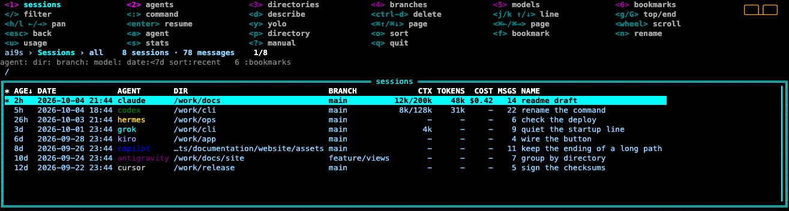
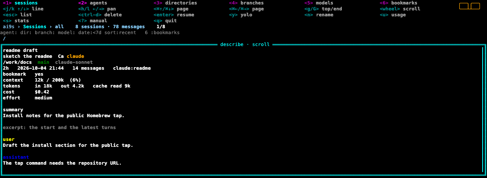
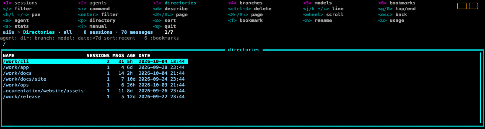
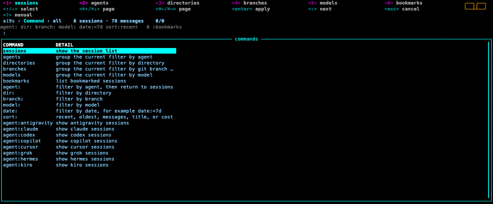
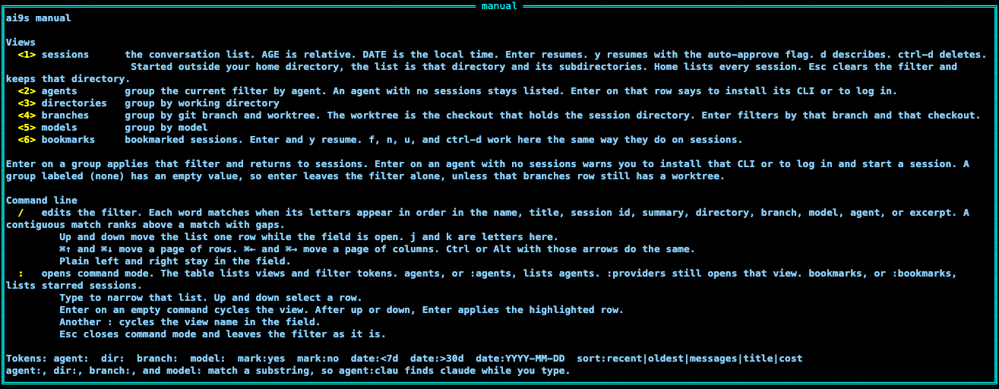
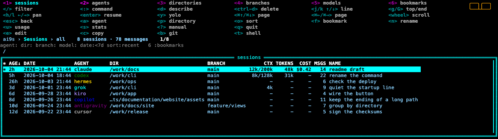

# ai9s

<p align="center">
  
</p>

<p align="center">
  <a href="https://ai9scli.io/">Website</a>
  ·
  <a href="https://github.com/AymanZahran/ai9s/actions/workflows/ci.yml">CI</a>
  ·
  <a href="LICENSE">MIT</a>
  ·
  <a href="https://github.com/sponsors/AymanZahran">Sponsor</a>
</p>

ai9s is a keyboard-first finder for local AI coding sessions. It indexes the session files already on your machine, then lets you search, preview, filter, resume, and — where it is safe — delete them.

The interface follows the k9s screen: a menu of hotkeys, a crumbs bar (`ai9s › Sessions › all`), and one framed table. Started in a project directory, the list shows sessions whose working directory is that directory or a subdirectory. Started in your home directory, the list shows every session. The AGENT column is the agent name. NAME is the last column. It is the session title, or the session id when the session has no title. `n` renames that name. The new name stays through a reindex. The list has no separate title column. Every column except NAME is cut to a fixed width. A path keeps its ending. `u` shows usage for the selected session. `s` shows counts for every session. `1` through `6` switch the table between sessions, agents, directories, branches, models, and bookmarks. `2` and `:agents` list agents. `:providers` still opens that view. `/` edits the filter and `:` opens a command line for those views and for filter tokens. Esc clears the filter from the list and from the filter line. `?` opens a scrollable manual. `d` replaces the list with a describe view of the selected row; Esc returns to the list. Ctrl-D deletes. The CTX column, describe, and `ai9s show` include context size and token counts when the agent recorded them. COST is the recorded USD amount, or a dash. `f` bookmarks the selected session. `6` or `:bookmarks` lists those sessions. The list reindexes every 30 seconds.

Colors, the mouse, icons, read-only mode, the starting view, and plugins come from `~/.config/ai9s/config.yaml` (or `$AI9S_CONFIG_DIR`, or `$XDG_CONFIG_HOME/ai9s`). `ai9s info` prints the paths.

## Interface

These pictures are the real interface, drawn from example sessions.

<p align="center">
  
</p>

`d` replaces the list with describe. NAME stays whole. A long directory keeps its ending.

<p align="center">
  
</p>

`3` groups by directory. `:` opens the command line. `?` opens the manual. `u` shows usage for the selected session.

<p align="center">
  
</p>

<p align="center">
  
</p>

<p align="center">
  
</p>

<p align="center">
  
</p>

Plugins add their own row of keys. The four examples are `e` edit, `c` copy, `b` git, and `t` shell.

<p align="center">
  
</p>

## Install

Install the latest 1.0 release. The supported line is 1.0.x. The same instructions are on the [install page](https://ai9scli.io/install.html).

`apt`, `dnf`, `yum`, `zypper`, `apk`, and the archives follow the latest GitHub release. Scoop, WinGet, Chocolatey, Nix, and the Arch `PKGBUILD` install the version named in their files in this repository. Use `amd64` on x86_64 and `arm64` on aarch64. Linux package filenames spell the OS in lowercase. Archive filenames spell it `Linux`, `Darwin`, or `Windows`.

### Homebrew

Homebrew works on macOS and Linux.

```sh
brew tap AymanZahran/ai9s https://github.com/AymanZahran/ai9s
brew trust aymanzahran/ai9s
brew install ai9s
```

The formula is `Formula/ai9s.rb` in this repository. `brew tap AymanZahran/ai9s` with no URL looks for a repository named `homebrew-ai9s`, so pass the URL above. `brew install --HEAD ai9s` builds the latest `main`.

### apt

Debian, Ubuntu, Linux Mint, Pop!_OS, and elementary OS:

```sh
curl -fL -o /tmp/ai9s.deb https://github.com/AymanZahran/ai9s/releases/latest/download/ai9s_linux_amd64.deb
sudo apt install -y /tmp/ai9s.deb
```

`sudo dpkg -i /tmp/ai9s.deb` installs the same file.

### dnf

Fedora, RHEL, CentOS Stream, AlmaLinux, Rocky Linux, and Amazon Linux:

```sh
sudo dnf install -y https://github.com/AymanZahran/ai9s/releases/latest/download/ai9s_linux_amd64.rpm
```

### yum

Older RHEL and CentOS:

```sh
curl -fL -o /tmp/ai9s.rpm https://github.com/AymanZahran/ai9s/releases/latest/download/ai9s_linux_amd64.rpm
sudo yum install -y /tmp/ai9s.rpm
```

### zypper

openSUSE Leap and Tumbleweed. The rpm is not signed with a zypper key.

```sh
curl -fL -o /tmp/ai9s.rpm https://github.com/AymanZahran/ai9s/releases/latest/download/ai9s_linux_amd64.rpm
sudo zypper --non-interactive install --allow-unsigned-rpm /tmp/ai9s.rpm
```

### apk

Alpine and postmarketOS. The apk is not signed with an Alpine key.

```sh
curl -fL -o /tmp/ai9s.apk https://github.com/AymanZahran/ai9s/releases/latest/download/ai9s_linux_amd64.apk
sudo apk add --allow-untrusted /tmp/ai9s.apk
```

### pacman

Arch Linux, Manjaro, EndeavourOS, and CachyOS, from the `PKGBUILD` in this repository:

```sh
git clone --depth 1 https://github.com/AymanZahran/ai9s.git
cd ai9s/packaging/arch
makepkg -si
```

### Nix

```sh
nix profile install github:AymanZahran/ai9s
```

The flake downloads the release archive for the host system.

### mise

mise installs the release archive. The pattern keeps the `.tar.gz` and `.zip` and leaves the deb, rpm, and apk alone.

```sh
mise use -g 'github:AymanZahran/ai9s[matching_regex=\.(tar\.gz|zip)$]'
```

### Scoop

```powershell
scoop install https://raw.githubusercontent.com/AymanZahran/ai9s/main/packaging/scoop/ai9s.json
```

### WinGet

WinGet installs from the manifest in this repository. Local manifests have to be turned on once.

```powershell
winget settings --enable LocalManifestFiles
git clone --depth 1 https://github.com/AymanZahran/ai9s.git $env:TEMP\ai9s
winget install --manifest $env:TEMP\ai9s\packaging\winget
```

### Chocolatey

Chocolatey packs the package in this repository, then installs that package.

```powershell
git clone --depth 1 https://github.com/AymanZahran/ai9s.git $env:TEMP\ai9s
Set-Location $env:TEMP\ai9s\packaging\chocolatey
choco pack
choco install ai9s --yes --source .
```

### Archives

macOS, Apple Silicon. Intel Macs use `ai9s_Darwin_amd64.tar.gz`.

```sh
mkdir -p ~/.local/bin "$TMPDIR/ai9s"
curl -fL https://github.com/AymanZahran/ai9s/releases/latest/download/ai9s_Darwin_arm64.tar.gz | tar -xz -C "$TMPDIR/ai9s"
install -m 755 "$TMPDIR/ai9s/ai9s" ~/.local/bin/ai9s
```

Linux. `arm64` is the aarch64 archive.

```sh
mkdir -p ~/.local/bin /tmp/ai9s
curl -fL https://github.com/AymanZahran/ai9s/releases/latest/download/ai9s_Linux_amd64.tar.gz | tar -xz -C /tmp/ai9s
install -m 755 /tmp/ai9s/ai9s ~/.local/bin/ai9s
```

Windows. `ai9s_Windows_arm64.zip` is the arm64 build. Put the extracted `ai9s.exe` on `PATH`.

```powershell
$dest = "$env:LOCALAPPDATA\ai9s"
New-Item -ItemType Directory -Force -Path $dest | Out-Null
Invoke-WebRequest https://github.com/AymanZahran/ai9s/releases/latest/download/ai9s_Windows_amd64.zip -OutFile "$dest\ai9s.zip"
Expand-Archive "$dest\ai9s.zip" -DestinationPath $dest -Force
```

### From source

Requires Go 1.25 or newer.

```sh
git clone https://github.com/AymanZahran/ai9s.git
cd ai9s
make install
```

`make install` puts the binary in `~/.local/bin`. Override that with `make install PREFIX=/usr/local`.

```sh
go install github.com/AymanZahran/ai9s@latest
```

## Usage

```sh
ai9s                 # open the list
ai9s index           # refresh the local index
ai9s stats
ai9s search 'agent:clau dir:~/my-repo date:<7d auth'
ai9s info
ai9s show claude:<session-id>
ai9s resume claude:<session-id>
ai9s resume codex:<session-id> --print   # show the command, do not run it
ai9s delete claude:<session-id>          # asks you to type the id
```

`--json` works on `index`, `stats`, `search`, and `show`. `y` in the session list, and `resume --yolo`, add an auto-approve flag only for agents that document one. `delete --yes` skips the prompt.

Resume runs that agent's own CLI, in the session's directory when that directory still exists.

## Keys

| Key | Action |
| --- | --- |
| `1`–`6` | Sessions, agents, directories, branches, models, bookmarks. Branches lists each git branch with the worktree that contains the session. `2` and `:agents` list agents. `:providers` still opens that view. `6` and `:bookmarks` list bookmarked sessions. The active view is bold in the top hotkey bar. |
| Enter | Resume the selected session. Quitting that session returns to ai9s, which takes the terminal back. On a group view, apply that group as a filter and return to sessions. On an agent with no sessions, ai9s says to install that CLI or to log in and start a session. |
| `y` | Resume the selected session and pass that agent's auto-approve flag. The top menu shows `y` `yolo` on sessions and bookmarks, and on describe for those lists. Agents without that flag resume with the same command Enter uses. On a group view, `y` says to switch to sessions. |
| `d` | Describe the selected row. The list is replaced by the preview. `j`/`k` or up/down scroll a line. `h`/`l` or left/right pan. ⌘↑/⌘↓ and ⌘←/⌘→ page. `g`/`G` jump to the top or the end. Esc returns to the list. Tab opens and closes the same view. |
| Ctrl-D | Delete, after confirmation. Sessions and bookmarks. |
| `/` | Edit the filter. Up and down move the list while the field is open. ⌘↑ and ⌘↓ move a page of rows. ⌘← and ⌘→ move a page of columns. Plain left and right stay in the field. `j` and `k` are letters here. |
| Esc | From describe, return to the list and leave the filter. After opening sessions from a group, return to that group and clear the filter. On that group, or on the sessions list itself, clear the filter and stay there. In the manual or command mode, Esc goes back and leaves the filter alone. |
| `:` | Command mode. Type a view name or a filter token. Up and down select a row. Enter applies the highlighted row. Enter on an empty command cycles the view. Another `:` cycles the view name in the field. Esc closes it. |
| `a` | Cycle the `agent:` filter |
| `p` | Add a `dir:` filter |
| `o` | Cycle sort: recent, oldest, messages, title, cost |
| `f` | Bookmark the selected session, or clear that bookmark. A star in the first column marks it. The bookmark stays through a reindex. `6` or `:bookmarks` lists bookmarks. Sessions and bookmarks. |
| `n` | Rename the selected session. Enter on Save stores the name. Esc cancels. An empty name restores the default. The name stays through a reindex. Sessions and bookmarks. |
| `u` | Usage for the selected session: messages, context, tokens, and the other recorded numbers. Sessions and bookmarks. |
| `s` | Stats for every indexed session. |
| `?` | Scrollable manual. `j`/`k` scroll, `g`/`G` jump, Esc or `q` returns to the list. |
| `q` | Quit |
| `j` / `k`, up / down | Move one line when the list or the preview is focused. Up and down do the same, including while `/` or `:` is open. In those fields, `j` and `k` are typed letters. |
| `g` / `G` | Jump to the top or the end of the list, the preview, or the manual. In `/` and `:` they are typed letters. |
| `h` / `l`, left / right | Pan when the list or the preview is focused. In the filter and command fields, plain left and right stay in the field and `h`/`l` are letters. |
| ⌘↑ / ⌘↓ | Move a page of rows. The list moves its selection. The preview scrolls its text. Control or Alt with up and down do the same, and so do Page Up, Page Down, Ctrl-B, and Ctrl-F. This also works while `/` or `:` is open. |
| ⌘← / ⌘→ | Move a page of columns, on the list and in describe, including while `/` or `:` is open. Control or Alt with left and right do the same. |
| Mouse | The wheel scrolls the view on screen, including the menu, the crumbs, and the manual. A horizontal wheel pans, and so does Shift with the vertical wheel. The list and describe each have a scrollbar on the right, and a scrollbar along the bottom when a line is wider than the window. Drag a bar or click it to jump. Hotkeys stay on the top menu. |

## Filters

Each free-text word matches when its letters appear in order in the name, title, session id, summary, directory, branch, model, agent, or excerpt. A contiguous match ranks above a match with gaps. With no `sort:` token, the closest matches come first. `sort:recent` keeps the newest sessions first. A leading `~` expands to the home directory. These tokens are filters:

| Token | Meaning |
| --- | --- |
| `agent:claude` | Agent id, or a substring of it, so `agent:clau` matches while you type. Also `a:`. An empty `agent:` is ignored. |
| `dir:repo` | Working directory contains the text. Also `cwd:` and `directory:`. `dir:~/repo` expands `~`. |
| `branch:main` | Git branch contains the text. |
| `model:sonnet` | Model name contains the text. |
| `date:<7d` | Updated in the last 7 days. Units: `m`, `h`, `d`, `w`. |
| `date:>30d` | Updated more than 30 days ago. |
| `date:2026-03-02` | That calendar day. `date:2026-03` is the whole month. |
| `mark:yes` | Bookmarked sessions. `mark:no` hides them. Also `bookmark:`, `fav:`, and `favorite:`. In the UI, `6` and `:bookmarks` open that list. |
| `sort:messages` | `recent` (default), `oldest`, `messages`, `title`, or `cost`. `title` follows the NAME column. `cost` follows the recorded USD amount. |

Quote a phrase to keep it together: `"auth bug"`. Esc on the session list clears the line.

## Config

ai9s writes `config.yaml` the first time it starts, when the file is missing. Skins go in `skins/<name>.yaml`. Plugins go in `plugins.yaml` or in `plugins/`. A plugin shortcut that uses `q`, `/`, `:`, `d`, `f`, `y`, `s`, `n`, `u`, `?`, `a`, `p`, `o`, `j`, `k`, `h`, `l`, `g`, `G`, `1`–`6`, Enter, Tab, Esc, or Ctrl-D is ignored. The command is a program name, not a shell. A bare name is looked up on `PATH`, then in the config `plugins/` directory. The selected row provides `$ID`, `$NATIVE_ID`, `$AGENT`, `$CWD`, `$TITLE`, `$BRANCH`, `$MODEL`, `$FILTER`, and `$NAME`.

`examples/plugins` has four plugins you copy in to turn on. `e` opens the directory in `AI9S_EDITOR`. `c` copies the fields you list to the clipboard. `b` shows git status and recent commits (`AI9S_GIT_LOG`). `t` opens a terminal there (`AI9S_TERMINAL`). Enabled keys are drawn on the menu. See `examples/plugins/README.md`.

`ui.skin` names a file in `skins/` without `.yaml`. `AI9S_SKIN` overrides it. An empty skin uses true black (`#000000`) with the k9s accent colors: blue text, an orange logo, a blue border, fuchsia view keys, and an aqua selection bar. The crumbs line stays black. The named `stock` skin is the older white-on-black palette. A skin file replaces the fields it sets. The menu is a grid. View keys are the first row, actions continue under them, and installed plugin keys get their own rows. `readOnly: true` blocks delete. `refreshRate` is seconds between reindexes. `0` uses 30. The minimum is 5. The list always refreshes on that interval.

## Metadata

AGE is always a relative age: now, minutes, hours, days, weeks, months, or years. DATE is the local date and time. Sort follows AGE. NAME is the name set with `n`. Otherwise it is the session title, or the session id when the title is missing or only repeats the native id. An empty name restores that default. The name stays through a reindex. `sort:title` sorts the NAME column. The list has no separate title column. NAME is the last column and is not cut. Every other column is cut to a fixed width. A path keeps its ending. The row pans to show the rest of the name. Describe shows the full value. Describe and `ai9s show` always print a context line and a token line. A dash means the session file did not record that number. The rest of the line appears when it was recorded: input, output, cache read, cache write, reasoning tokens, cost, premium requests, and reasoning effort. The CTX column is the latest prompt size, or `used/window` when both are known. The TOKENS column is the session total, or input plus output when the file has no total. The COST column is the recorded USD amount, or a dash when the file has none. A star in the first column is a bookmark.

Claude records per-turn usage and cost. Codex records token totals and, when present, the context window. Copilot CLI records the latest prompt size, cache, reasoning effort, and premium requests. OpenCode records session token totals, cost, and the latest prompt size. Grok records the latest context and window, token totals, cache, reasoning, cost, and reasoning effort. Hermes records token totals, cost, and the latest prompt size, and does not record a window. Cursor records the latest context and window when composer data has them, and does not record a session token total. Antigravity records the latest context and window and sums per-generation input, output, cache read, and reasoning. OpenClaw records the context window separately from the estimated prompt size, and an estimated cost when the file has one. Goose and Cline record token totals and cost. Gemini, Junie, Jules, Aider, Kiro, and Mistral leave the token lines empty. Kiro's database does not store those numbers. Qwen records the latest prompt size, the context window, and the sum of assistant output tokens. MiniMax records token totals and cost. Kimi records the latest measured token count as context and does not record a session total.

## Agents

Paths below are the defaults. Each one can be pointed somewhere else with the environment variable in the last column. ai9s only reads session stores that exist; a missing directory is skipped.

| Agent | What is read | Resume | Delete | Override |
| --- | --- | --- | --- | --- |
| `claude` | `$CLAUDE_CONFIG_DIR/projects/**/*.jsonl` | `claude --resume <id>` | the transcript file | `CLAUDE_CONFIG_DIR` |
| `codex` | `$CODEX_HOME/sessions/**/rollout-*.jsonl` | `codex resume <id>` | the rollout file | `CODEX_HOME` |
| `copilot` | `$COPILOT_HOME/session-state/<id>/` | `copilot --resume <id>` | that session directory | `COPILOT_HOME` |
| `grok` | `$GROK_HOME/sessions/**/summary.json` | `grok --resume <id>` | that session directory, and its active-session and metadata entries | `GROK_HOME` |
| `antigravity` | `$GEMINI_HOME/antigravity-cli/history.jsonl` | `agy --conversation <id>` | that conversation's lines | `GEMINI_HOME` |
| `gemini` | `$GEMINI_HOME/tmp/<project>/chats/session-*.json` | `gemini --session-file <path>` | that chat file | `GEMINI_HOME` |
| `cursor` | `$CURSOR_HOME/projects/**/agent-transcripts/<id>/<id>.jsonl` | `cursor-agent --resume <id>` (or `agent`) | the transcript file | `CURSOR_HOME` |
| `opencode` | `$XDG_DATA_HOME/opencode/opencode.db` | `opencode --session <id>` | `opencode session delete <id>` | `OPENCODE_DB` |
| `hermes` | `$HERMES_HOME/state.db` and `profiles/<name>/state.db` | `hermes --resume <id>` (`-p <profile>` for a named profile) | `hermes sessions delete <id> --yes` | `HERMES_HOME` |
| `openclaw` | `$OPENCLAW_STATE_DIR/agents/<id>/agent/openclaw-agent.sqlite` | `openclaw resume <session-key>` | `openclaw sessions delete <key> --yes` | `OPENCLAW_STATE_DIR`, else `OPENCLAW_HOME` |
| `junie` | `$JUNIE_HOME/sessions/session-*/transcript.md` | `junie --resume --session-id=<id>` | that session directory | `JUNIE_HOME` |
| `jules` | `$JULES_HOME/sessions.json` or `sessions.txt` | `jules teleport <id>` | that row, or the cloud session when `JULES_API_KEY` is set | `JULES_HOME` |
| `goose` | `$GOOSE_HOME/sessions/sessions.db` | `goose session --resume --session-id <id>` | `goose session remove --session-id <id>` | `GOOSE_HOME` |
| `cline` | `$CLINE_HOME/data/state/taskHistory.json` | `cline task open <id>` | rewrite the history, then remove the task directory | `CLINE_HOME` |
| `aider` | `.aider.chat.history.md` under the configured roots, and `~/.aider.chat.history.md` when those are unset | `aider --restore-chat-history` | that history file | `AIDER_CHAT_ROOTS`, `AIDER_HOME`, `AIDER_CHAT_HISTORY` |
| `kiro` | `kiro-cli` `data.sqlite3` (`conversations_v2`) | `kiro-cli chat --resume-id <id>` | that conversation; the shell history table stays | `KIRO_CLI_DB`, else `KIRO_HOME` |
| `kimi` | `$KIMI_CODE_HOME/sessions/<workDirKey>/<id>/state.json` and `agents/main/wire.jsonl` | `kimi --session <id>` | that session directory and its `session_index.jsonl` line | `KIMI_CODE_HOME` |
| `minimax` | `$MINIMAX_DATA_DIR/v2/sqlite/runtime-state.sqlite` (`local_runtime_sessions`), and `v2/sessions/.../messages.jsonl` when that database is absent | `mcode --session <id>` | that session row and its history directory | `MINIMAX_DATA_DIR`, else `MAVIS_DATA_DIR` |
| `qwen` | `$QWEN_RUNTIME_DIR/projects/<sanitized-cwd>/chats/<id>.jsonl` (also `chats/archive`; `$QWEN_HOME` when the runtime dir is unset) | `qwen --resume <id>` | that chat file | `QWEN_RUNTIME_DIR`, else `QWEN_HOME` |
| `mistral` | `$VIBE_HOME/logs/session/<dir>/` (`meta.json`, `messages.jsonl`) | `vibe --resume <id>` | that session directory | `VIBE_HOME` |

Yolo maps to a documented flag: Claude and Antigravity `--dangerously-skip-permissions`, Grok `--always-approve`, Copilot `--allow-all-tools`, Cursor `--force`, Hermes `--yolo`, Junie `--brave`, Cline `--yolo`, Kiro `--trust-all-tools`, Qwen `--yolo`, Mistral `--yolo` (`--auto-approve` is the same flag). Codex, Gemini, OpenCode, OpenClaw, Jules, Goose, Aider, Kimi, and MiniMax are resumed without an extra approval flag.

Subagent transcripts are skipped. Kiro's shell `history` table is skipped on scan and on delete. Resume for Kiro uses `kiro-cli`, which is separate from the Kiro IDE. Goose resume and delete need the `goose` command on `PATH`. Jules listing talks to Google only when `AI9S_JULES_REMOTE=1`; otherwise ai9s reads the local snapshot. Deleting a remote Jules session talks to Google only when `JULES_API_KEY` is set. Aider does not walk the home directory unless `AIDER_SCAN_HOME=1`. It does read `~/.aider.chat.history.md`, the chat aider writes when it is started from home outside a git repo. A chat inside another project is read when that project is listed in `AIDER_CHAT_ROOTS`. Kimi Code is read from `KIMI_CODE_HOME` (default `~/.kimi-code`). The archived kimi-cli store `~/.kimi` is not read. MiniMax is read from `MINIMAX_DATA_DIR`, or from `MAVIS_DATA_DIR` when that is unset. The MiniMax install prefix `~/.minimax-code` is not the data directory. A `[session_logging] save_dir` in the Vibe `config.toml` replaces `logs/session` when that directory is safe. Child sessions are skipped.

### What delete removes

Grok delete removes the one session directory whose name is that session id, when `summary.json` is a regular file inside it. It also drops that id from `active_sessions.json` and `client-state/session-meta.json` when those files exist. The project `prompt_history.jsonl` stays.

Gemini delete removes that one `session-*.json` file under `tmp/<project>/chats/`, after the file's `sessionId` matches. Project caches and `projects.json` stay.

Kiro delete removes that conversation from `conversations_v2` and, when the same key is present, from `conversations`. The shell `history` table is left as it is. The database file stays.

Kimi delete rewrites `session_index.jsonl` without that session id, then removes that one session directory. A sibling session in the same work directory stays.

Qwen delete removes that one chat file under `chats/` or `chats/archive/`. Other chats stay.

Mistral delete removes that one session directory under the Vibe save directory, when `meta.json` and `messages.jsonl` are regular files and the session id matches.

MiniMax delete, when the session came from `runtime-state.sqlite`, removes that session's history directory when the manifest id matches, then deletes that session's rows. The database file stays. A manifest-only session removes that one history directory.

Jules keeps a local list in `sessions.json` or `sessions.txt`. Delete rewrites that file without the chosen id. The `jules` command has no delete subcommand. A remote session (`jules:remote`) is deleted with the Jules API when `JULES_API_KEY` is set. Without that key, the cloud session is left in place and delete says so. ai9s does not read the Jules keyring.

Antigravity stores every conversation in one `history.jsonl`. Delete rewrites that file without the chosen conversation id. Cline delete rewrites `taskHistory.json` first, then removes that task's directory. OpenCode, Hermes, OpenClaw, and Goose delete through each CLI. Other deletes remove a single transcript or Aider history file, or one Copilot `session-state` or Junie `session-*` directory, and only when the path is still inside that agent's session root.

## Index

The index lives at `$AI9S_CACHE_DIR/index.db`, or `$XDG_CACHE_HOME/ai9s/index.db`, or `~/.cache/ai9s/index.db`. It stores titles, metadata, and short excerpts (the first and last part of each transcript), not a second full copy of every log.

`ai9s index`, and opening the UI, scan again and skip files whose modification time has not changed. One agent failing to scan does not drop the others. Delete the index directory any time; the next run rebuilds it from the agent files.

## Development

```sh
go test ./...
make build
```

GitHub Actions runs that test suite on Ubuntu for Go 1.25 and for the current stable Go, and on macOS and Windows. `cmd/integration_test.go` builds the binary and runs `index`, `search`, `show`, `resume --print`, and `delete` against temporary fixtures. The fixtures override every agent home, so the test does not read a developer's real sessions, and Jules is not contacted. A missing `gofmt` diff fails the same workflow. `golangci-lint` runs as its own job.

The documentation site lives in [`site/`](site/) and is published with GitHub Pages from [`.github/workflows/pages.yml`](.github/workflows/pages.yml). The site is aimed at [ai9scli.io](https://ai9scli.io/). See [CONTRIBUTING.md](CONTRIBUTING.md) before opening a pull request, and [SECURITY.md](SECURITY.md) for private vulnerability reports.

`ai9s version` prints the version baked in at build time. A local `make build` uses the current git tag. A release is an annotated tag. `make release` opens a pull request for the changelog when `## Unreleased` has notes, waits for the checks, squash-merges it, and then pushes `vX.Y.Z`. GoReleaser builds the GitHub Release, and from that tag onward Cosign signs the checksum file. The formula update is a second pull request. `make release VERSION=1.2.3` chooses the version. `PART=minor` or `PART=major` bumps that component. Put notes under `## Unreleased` in [CHANGELOG.md](CHANGELOG.md) first when you want them in the changelog; otherwise the release notes are the commits.

## License

MIT. See [LICENSE](LICENSE).
